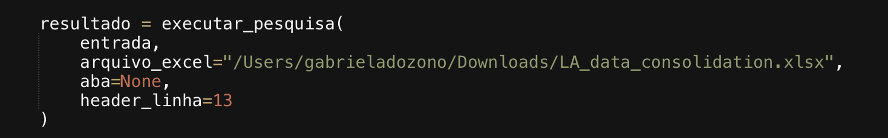
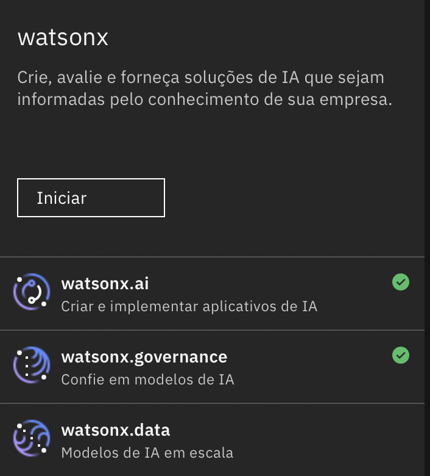
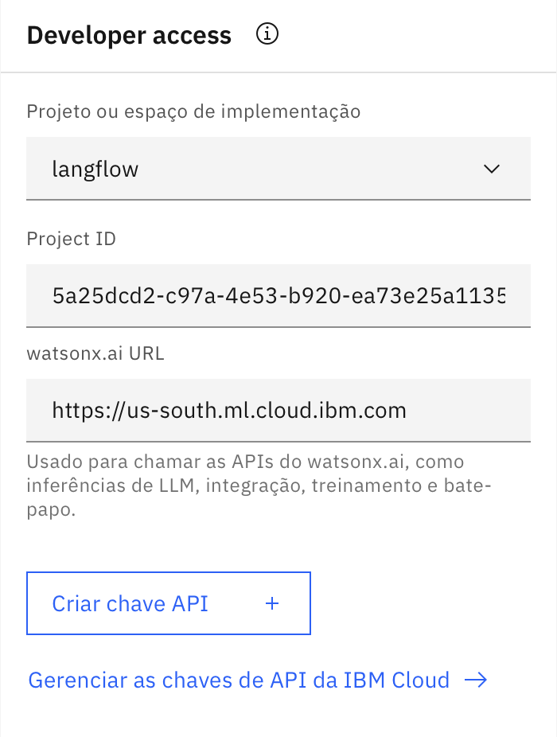
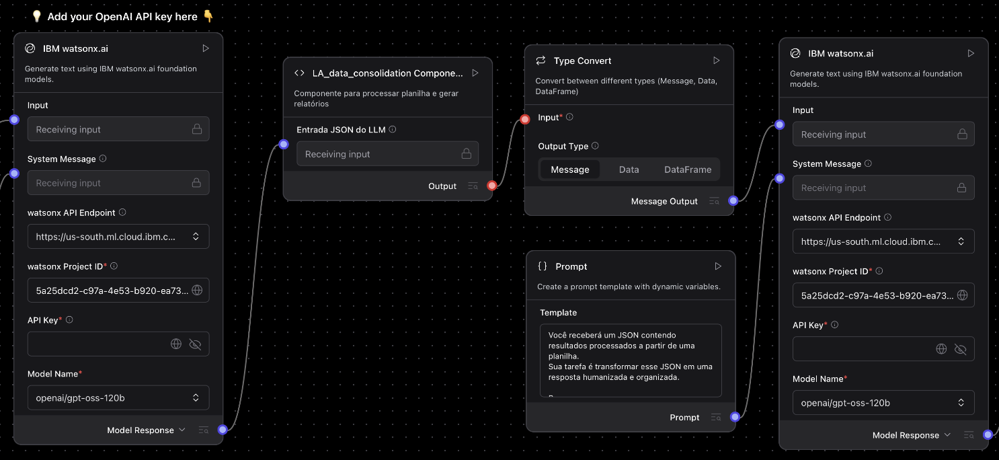
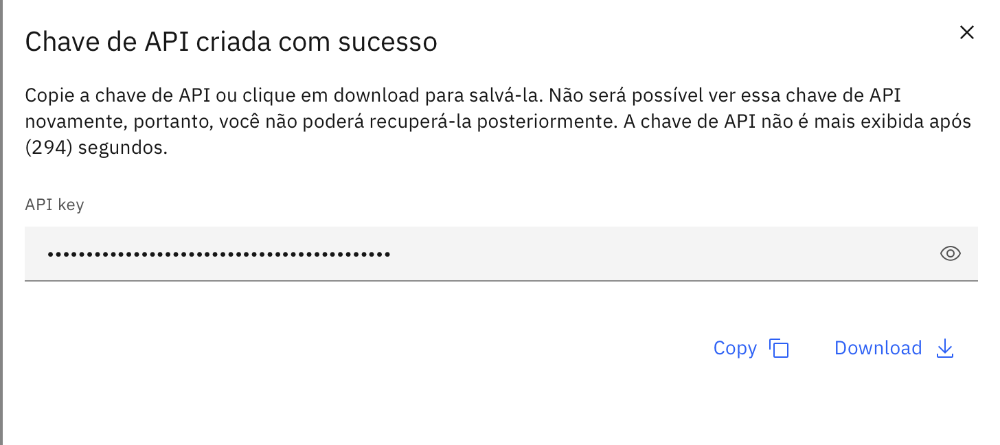

# Tutorial para baixar o fluxo completo do Langflow

Este tutorial mostra como apenas baixar o fluxo já completo e fazer as alterações necessárias.

## 1. Baixar o arquivo do fluxo
Baixe o arquivo JSON do fluxo completo

👉🏼 [Clique aqui para visualizar o arquivo `prompt_llm.txt`](codigo/fluxo.json)

## 2. Faça o upload do arquivo
- Na página principal do Langflow, vá na aba "projects" e clique no símbolo de upload.

  

## 3. Alterações necessárias
- Altere o caminho da planilha
- Altere o project ID
- Altere a API key

Para **mudar o caminho** local da planilha:
- Entre no código do componente customizado.
- Troque o caminho da planilha pelo novo caminho.
- Essa parte está na linha 269 do código
- Verifique se o caminho esta entre aspas

 
   

Para adicionar o project ID e a API key:
-  Reserve o ambiente do watsonx na techzone. Busque por "watsonx Orchestrate Trial/Standard plan".

 
   

> Link Techzone: https://techzone.ibm.com/home

- Na IBM cloud, acesse a aba da lista de recursos (4 tracinhos no canto superior esquerdo).

 
   

  
- Clique em watsonx, localizado na canto inferior.
- Clique em "iniciar" na caixinha **watsonx**

 
   

- Descendo um pouco a página crie um novo projeto. É necessário apenas um nome.

 
   

  
- Suba a página e na caixinha "Developer access" troque a opção de "projeto ou espaço de implementação" para o projeto criado.

 
   

- Copie o valor de "Project ID" e cole no campo **"watson Project ID"** nas caixinhas do watsonx.ai no Langflow.

 
   

- Volte para a caixinha "Developer access" no watsonx e clique em **criar chave API**. Qualquer nome pode ser dado.

 
   

- Copie o valor e cole no campo "API Key" nas caixinhas do watsonx.ai no Langflow.

 
   

## 4. Ajuste opcionais
Alterações podems er feitas de acordo com sua vontade, como:
- O mapeamento de termos
- Prompt da LLM

Para isso, apenas siga a estrutura de cada componente para realizar qualquer alteração. Precisando de ajuda é só mandar mensagem!

✅ Pronto! Agora o fluxo está pronto para ser usado!

## 5. Rodar o fluxo
Da forma que a primeira LLM está configurada, há uma forma específica de enviar o input/pergunta.

Nas perguntas é necessário citar o termo, da bibloteca de termos do código, que quer ver, sendo ele sozinho ou acompanhado do filtro que será feito, por exemplo:
- Caso eu queira ver casos de 9176 de Itaú com preço final, o input seria: quero ver **casos** e **total price** de **path** 9176 e **client** itau.
> Palavras que estão em negrito são os termos do mapeamento, eles podem ser alterados de acordo com oque querem usar.

> Observe que letras maiúsculas e acentos não são necessários, o fluxo rodará mesmo assim. 

Para rodar uma pergunta há duas opções:
- Escrever a pergunta dentro da caixinha do input e depois clicar no símbolo de play na caixinha do output.
- Ou entrar no playground, no canto superior direito, e mandar a pergunta.
> A resposta sempre estará no playground, independente da forma que o fluxo foi rodado.
